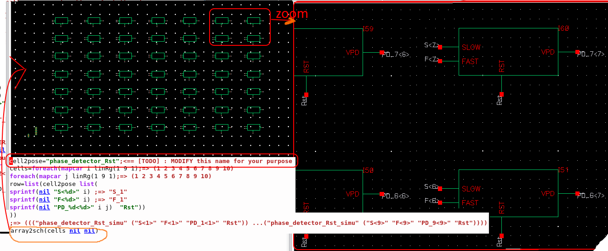
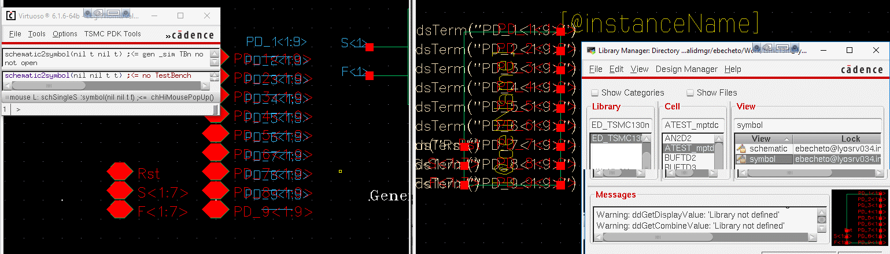

*addCell* function example
--------------------------
Here is an example that puts the element written in a list, into the open (empty or no) schematic.
`addCell('("gnd" "vdc" "vdd" "noConn" "vbit" "vpulse" "vsin"))`.
The library names can be specified with the fifth parameter list.
`addCell('("gnd" "noConn") t nil t '("analogLib"  "basic"))`

Personnal comment : this function is given for 'howto' puspose, i do not really use it generally. I prefer function array2sch, see below.

*freeLCK* function example
--------------------------
When a schematic view is opened in Read mode.
Remove existing lock that belongs to you (that you have the right to delete). Opened from a crashed session for instance. And it puts the schematic in the edit mode

*array2sch* function example
--------------------------
Take, or generate for your needs, a list with the cellName and its input and output incremanted (or not) names. Then is creates an array of cells with net and labels on top in the opened schematic cellView.

*schematic2symbol* function example
--------------------------
From an open schematic with pins, generate a rectangle symbol with the pins at the same location distance of the schematic.
For practical simplicity, i use named label to put pins in a nearby area.

