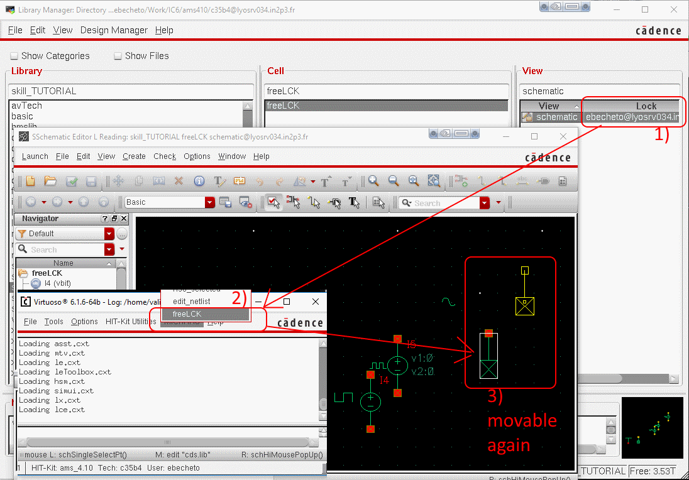

*addCell* function example
--------------------------
Here is an example that puts the element written in a list, into the open (empty or no) schematic.
`addCell('("gnd" "vdc" "vdd" "noConn" "vbit" "vpulse" "vsin"))`

The library names can be specified with the fifth parameter list.
`addCell('("gnd" "noConn") t nil t '("analogLib"  "basic"))`

*freeLCK* function example
--------------------------
When a schematic view is opened in Read mode.
Remove existing lock that belongs to you (that you have the right to delete). Opened from a crashed session for instance. And it puts the schematic in the edit mode

